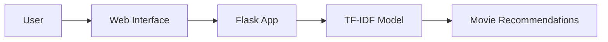

# Movie Recommendation System (TF-IDF)

  

Welcome to the **Movie Recommendation System** project! This project uses a TF-IDF model to recommend movies based on textual descriptions. Below, you'll find all the information you need to set up and run the project.

  

## Table of Contents

- [Project Structure](#project-structure)

- [Installation](#installation)

- [Usage](#usage)

- [TF-IDF Model](#tf-idf-model)

- [Architecture](#architecture)

- [Credits](#credits)

  

## Project Structure

  

```plaintext

movie_recommendation/

├── app.py

├── templates/

│ └── index.html

├── static/

│ └── style.css

├── movies.csv

├── requirements.txt

└── .srcenv/

```

  

- **app.py**: The main Flask application file.

- **templates/index.html**: The HTML template for the web interface.

- **static/style.css**: The CSS file for styling the web interface.

- **movies.csv**: The dataset containing movie information.

- **requirements.txt**: The file listing all Python dependencies.

  

## Installation

  

Follow these steps to set up the project on your local machine:

  

1. **Clone the repository**:

```bash

git clone https://github.com/yourusername/movie_recommendation.git

cd movie_recommendation

```

  

2. **Create a virtual environment** (optional but recommended):

```bash

python -m venv venv

source venv/bin/activate # On Windows, use `venv\Scripts\activate`

```

  

3. **Install the required packages**:

```bash

pip install -r requirements.txt

```

  

4. **Run the Flask application**:

```bash

python app.py

```

  

5. **Access the application**:

Open your web browser and go to `http://127.0.0.1:5000`.

  

## Usage

  

1. Open the web application in your browser.

2. Enter a description or keywords related to the type of movie you're looking for.

3. Click the "Recommend" button.

4. The system will display a list of recommended movies based on the provided description.

  

## TF-IDF Model

  

### What is TF-IDF?

  

TF-IDF stands for Term Frequency-Inverse Document Frequency. It is a numerical statistic intended to reflect how important a word is to a document in a collection or corpus. The importance increases proportionally to the number of times a word appears in the document but is offset by the frequency of the word in the corpus.

  

### Mathematical Formulation

  

The TF-IDF value is calculated as:

  

$$ \text{TF-IDF}(t, d, D) = \text{TF}(t, d) \times \text{IDF}(t, D) $$

  

Where:

- ${TF}(t, d)$  is the term frequency of term $(t)$ in document $(d)$  and,

- ${IDF}(t, D)$  is the inverse document frequency of term $(t)$ across all documents $(D)$.

  

The term frequency ${TF}(t, d)$ is calculated as:

$$ \text{TF}(t, d) = \frac{\text{Number of times term } t \text{ appears in document } d}{\text{Total number of terms in document } d} $$

  

The inverse document frequency \( \text{IDF}(t, D) \) is calculated as:

$$ \text{IDF}(t, D) = \log \left( \frac{N}{|\{d \in D : t \in d\}|} \right) $$

Where:

- $N$ is the total number of documents.

- $\{d \in D : t \in d\}$ is the number of documents where the term $(t)$ appears.

  

## Architecture

The architecture of the Movie Recommendation System is depicted below:

  


  

1. **User**: Interacts with the web interface.

2. **Web Interface**: Captures user input and displays recommendations.

3. **Flask App**: Processes the input and communicates with the TF-IDF model.

4. **TF-IDF Model**: Computes similarity scores based on the input and movie descriptions.

5. **Movie Recommendations**: Generated list of recommended movies.

  

## Credits 

  

This project is developed by [Sibasish Dey](https://github.com/Jishu15) and [Riddhiman Dutta](https://github.com/cdnjmusic). Contributions are welcome! Please fork the repository and create a pull request with your enhancements.

  

Feel free to reach out with any questions or feedback. Enjoy exploring and happy movie watching!
